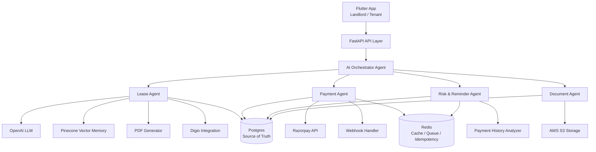

# KirayaEase

KirayaEase is an AI-Native Rent Operating System designed run rental operations for property owners on autopilot. 

At the core of the solution is an AI-workflow that integrates with KYC, Payment & Communication Channels and can autonomously run end-to-end rental operations. From verifying tenants, to ensuring on-time payments, to recommending market insights to increase rental yield. 

By turning rent into a predictable, financeable expense, we’re simplifying the rental experience and building a future where paying rent is a seamless autonomous experience.

## Table of Contents

- [Background](#background)
- [Features](#features)
- [Getting Started](#getting-started)
- [Installation](#installation)
- [FinTech Integrations](#integrations)
- [Usage](#usage)
- [API Documentation](#api-documentation)
- [Contributing](#contributing)
- [License](#license)

## Features

- **Rent Payment Collection**: (Razorpay)
    - Tenants can pay Landlords using digital payment platforms
    - UPI-Based Apps 
    - Credit Card Payment 
    - Digital Wallets and Banking Apps
    - Net Banking

- **Landlord and Tenant Profiles & Onboarding**:
    - Tenant Endorsements
    - KYC Verification (via PAN, Aadhaar, or DigiLocker)
    - Property Document, sale deed
    - Lease History

- **Embedded Credit**: 
    - Rent + Security Deposit specific credit.
    - Partner NBFC/Bank to offer credit line.

- **Document Management**:
    - Rent Receipts 
    - Lease Agreements
    - Utility Bills

- **Credit Builder**:
    - Point System
    - Rewards
    - Cashback

- **Communication**:
    - Disputes 
    - Queries 
    - Reminders


## Getting Started

### Prerequisites

- **Python** (3.8+)
- **Flutter** (3.16+)
- **Dart SDK**
- **Android Studio / Xcode** (for mobile emulation or real device testing)
- Backend dependencies (FastAPI, SQLite)

## Solution Architechture 



## Installation

### 1. Backend/Frontend (Python + FastAPI + Flutter)

```bash
# Clone the repository
git clone https://github.com/your-username/kiraya-ease.git
cd kiraya-ease
# Create virtual environment
python3 -m venv venv
source venv/bin/activate  # or venv\Scripts\activate on Windows

# Install Python dependencies
pip install -r requirements.txt

### 2. Frontend (Flutter/Dart)

# Navigate to the Flutter project directory (assumed to be ./kirayaease_flutter)
cd kirayaease/frontend

# Get Flutter dependencies
flutter pub get

# Run on emulator or device
flutter run
```

## Fintech Integrations

Connecting to industry-leading fintech and verification APIs for a seamless rent-tech experience. Below are the key integrations:

    1. Whatsapp Meta (Onboarding, Rent Reminders Communication Channel)

    2. Razorpay (Payments)

    3. Account Aggregator (Setu-AA) Framework

    4. Digio (DigiLocker & eKYC)

    5. TransUnion CIBIL (Credit Bureau Integration)


## API Documentation

    - Request OTP (POST/request-otp)    
    - Verify OTP(POST/verify-otp)
    - User Onboarding(POST/user-onboarding)
    - User Profile(GET/user-profile)
    - Create Payment Order(POST/create-payment-order)
    - DigioKYC (POST/digio-kyc)
    - Extract Lease Details(POST/extract-lease)
    - AI Assistant(POST/chatbot)

## Contributing

Ansh Agarwal

## License

Copyright (c) 2025 KirayaEase LLP

