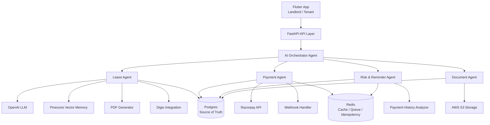

# KirayaEase

KirayaEase is an AI-powered rent payment platform designed to make renting intelligent, secure, and stress-free—for tenants.

At the core of our solution is a platform that powers flexible rent splitting and structured payment plans, backed by an integrated credit line that smooths out cash flow. Tenants can spread rent across the month, while landlords receive payments on time, every time.

By turning rent into a predictable, financeable expense, we’re simplifying the rental experience and building a future where paying rent is as seamless and empowering as using a digital payments app.

## Table of Contents

- [Background](#background)
- [Features](#features)
- [Getting Started](#getting-started)
- [Installation](#installation)
- [FinTech Integrations](#integrations)
- [Usage](#usage)
- [API Documentation](#api-documentation)
- [Contributing](#contributing)
- [License](#license)

## Features

- **Rent Payment Collection**: 
    - Tenants can pay Landlords using digital payment platforms
    - UPI-Based Apps 
    - Credit Card Payment 
    - Digital Wallets and Banking Apps
    - Net Banking

- **Landlord and Tenant Profiles & Onboarding**:
    - Tenant Endorsements
    - KYC Verification (via PAN, Aadhaar, or DigiLocker)
    - Property Document, sale deed
    - Lease History

- **Embedded Credit**: 
    - Rent + Security Deposit specific credit.
    - Partner NBFC/Bank to offer credit line.

- **Decentralized Document Management**:
    - Rent Receipts 
    - Lease Agreements
    - Utility Bills

- **Personalized AI Assistant and Analytics**:
    - Portfolio level analytics
    - Personal AI Agent using OpenAI, Claude

- **Credit Builder**:
    - Point System
    - Rewards
    - Cashback

- **Communication**:
    - Disputes 
    - Queries 
    - Reminders


## Getting Started

### Prerequisites

- **Python** (3.8+)
- **Flutter** (3.16+)
- **Dart SDK**
- **Android Studio / Xcode** (for mobile emulation or real device testing)
- Backend dependencies (FastAPI, SQLite)

## Solution Architechture 



## Installation

### 1. Backend/Frontend (Python + FastAPI + Flutter)

```bash
# Clone the repository
git clone https://github.com/your-username/kiraya-ease.git
cd kiraya-ease
sqlite3 /Users/anshagarwal/Desktop/KirayaEase/data/KE_db.db < /Users/anshagarwal/Desktop/KirayaEase/data/schema.sql
# Create virtual environment
python3 -m venv venv
source venv/bin/activate  # or venv\Scripts\activate on Windows

# Install Python dependencies
pip install -r requirements.txt

### 2. Frontend (Flutter/Dart)

# Navigate to the Flutter project directory (assumed to be ./kirayaease_flutter)
cd kirayaease/frontend

# Get Flutter dependencies
flutter pub get

# Run on emulator or device
flutter run
```

## Fintech Integrations

Connecting to industry-leading fintech and verification APIs for a seamless rent-tech experience. Below are the key integrations:

    1. MSG91 (OTP & SMS Notifications)

    2. Razorpay (Payments)

    3. Account Aggregator (AA) Framework

    4. Digio (DigiLocker & eKYC)

    5. TransUnion CIBIL (Credit Bureau Integration)


## API Documentation

    - Request OTP (POST/request-otp)    
    - Verify OTP(POST/verify-otp)
    - User Onboarding(POST/user-onboarding)
    - User Profile(GET/user-profile)
    - Create Payment Order(POST/create-payment-order)
    - DigioKYC (POST/digio-kyc)
    - Extract Lease Details(POST/extract-lease)
    - AI Assistant(POST/chatbot)

### DocuSeal (lease e-sign)

After a lease PDF is stored (`lease_files`), landlords can start signing via DocuSeal’s [Create submission from PDF](https://www.docuseal.com/docs/api#create-a-submission-from-pdf) API.

**Heroku / env**

| Variable | Required | Description |
|----------|----------|-------------|
| `DOCUSEAL_API_KEY` | Yes | DocuSeal API token (`X-Auth-Token`) |
| `DOCUSEAL_API_BASE` | No | Default `https://api.docuseal.com` (EU: `https://api.docuseal.eu`) |
| `DOCUSEAL_WEBHOOK_SECRET` | No | If set, webhooks must pass the same value as query `?secret=...` or header `X-KirayaEase-Webhook-Secret` |
| `DOCUSEAL_WEBHOOK_KEY` + `DOCUSEAL_WEBHOOK_VALUE` | No | Alternate webhook auth mode: request must include query/header named by `DOCUSEAL_WEBHOOK_KEY` with value `DOCUSEAL_WEBHOOK_VALUE` |
| `DOCUSEAL_SUBMISSION_SHARED_LINK` | No | Default `true` — request `shared_link` on `POST /submissions/pdf` so DocuSeal returns shareable `embed_src` links (e.g. WhatsApp) |

**HTTP**

- `POST /leases/{lease_id}/docuseal/submission` — authenticated landlord; body requires `tenant_email` and optional `landlord_email` for two-party signing.
- `POST /webhooks/docuseal` — paste into DocuSeal webhook settings (public URL on your app).

**Agent tool:** `send_lease_for_signature_docuseal` (after `lease_id` exists and PDF is saved).

### WhatsApp (rent reminders)

Rent reminders use the Meta template **`kirayaeaseonboarding`** (hardcoded) with **`en_US`** language and **positional** body parameters: **`tenant_name`**, **`amount`** (monthly rent digits only; template adds ₹), **`property_name`**, **`due_date`** (next due on `due_day`). Values come from Postgres.

| Variable | Default | Description |
|----------|---------|-------------|
| `WHATSAPP_PAT_TOKEN` / `PHONE_ID` | Yes for sends | Meta Cloud API token and phone number ID |
| `WHATSAPP_GRAPH_VERSION` | `v24.0` | Graph API version (optional override) |

**Agent tool:** `send_rent_reminder_whatsapp` (tenant WhatsApp on `properties.tenant_phone`).

## Contributing

Ansh Agarwal

## License

Copyright (c) 2025 KirayaEase LLP

